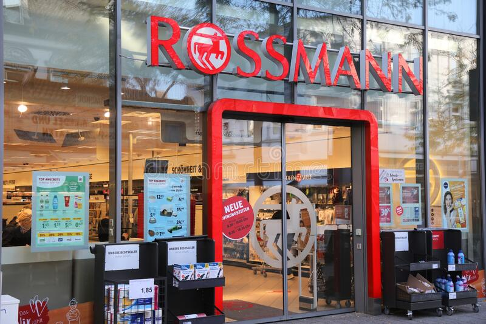
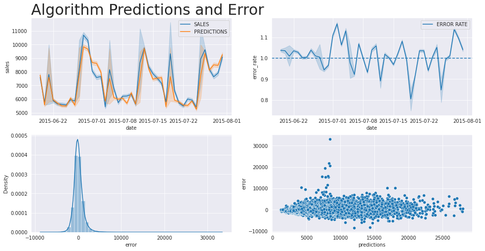
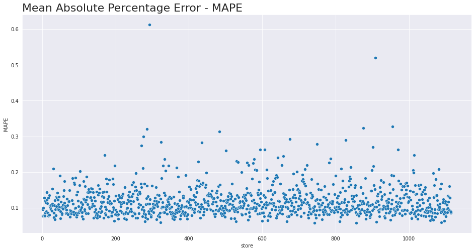
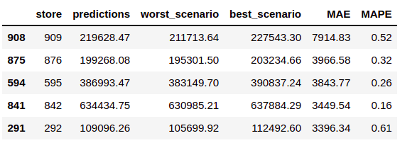

# Rossmann Store Sales
## Sales Forecast

# 1 Business Challenge

Rossmann operates over 3,000 drug stores in 7 European countries. Currently, Rossmann store managers are tasked with predicting their daily sales for up to six weeks in advance. Store sales are influenced by many factors, including promotions, competition, school and state holidays, seasonality, and locality. 
With thousands of individual managers predicting sales based on their unique circumstances, the accuracy of results can be quite varied. (kaggle.com)

# 2 Business Assumptions

	- Corporate Administration cannot use sales forecasts without a standardized methodology
	
	- Managers have different experiences and perspectives on sales forecasting

	- The CFO has many problems setting the budget and making decisions

	- A Machine Learning model can predict sales for all stores

# 3 Solution Strategy

**Step 01 - Data extraction:** Available data has been collected and merged

**Step 02 - Transformations:** Viewing data descriptions and making changes (renaming columns, changing data types, and filling in missing values) 

**Step 03 - Feature Engineering:** Creating new data attributes 

**Step 04 - Exploratory Data Analysis:** Univariate, bivariate and multivariate analysis

**Step 05 - Data Modeling:** Preparing data for sales forecasting

**Step 06 - Feature Selection:** Feature importance with Boruta algorithm

**Step 07 - Machine Learning:** Testing algorithms to choose a model

**Step 08 - Hyperparameter Fine Tuning:** Random search strategy to set parameters

**Step 09 - Error interpretation:** Machine Learning performance and business performance of the model

**Step 10 - Deploy:** Availability of API on Heroku and access to forecasts via Telegram

# 4 Top 3 Data Insights

**Hypothesis 1** - Stores with a larger assortment sell more 

**True**: Extra and extended assortment, on average, sells more

**Hypothesis 2** - Stores with competition nearby sell less

**False**: The total and average sales of stores with close competitors are higher

**Hypothesis 7** - Sales are higher over the years

**False**: Sales are lower over the years

# 5 Machine Learning Model

XGBoost was selected because it has good model performance and uses less computational resources compared to Random Forest

# 6 Machine Learning Performance

For most stores, the algorithm error was around $10,000.00

# 7 Business Result

Business team can use the prediction and consider the best and worst scenario base no Mean Absolute Error - MAE and Mean Absolute Percentage Erro - MAPE.

Telegram Bot: @RossmannSalesBot

# 8 Conclusions

Some stores have a higher error rate compared to others; these stores are harder to predict, requiring another modeling strategy. 

# 9 Lessons Learned

The model has an Absolute Average Percentage Error - MAPE of less than 30% for most stores, but two stores have an error greater than 50%, requiring another forecasting approach.

# 10 Next Steps to Improve

Treat the problem as a simple time series to compare to the current model.
