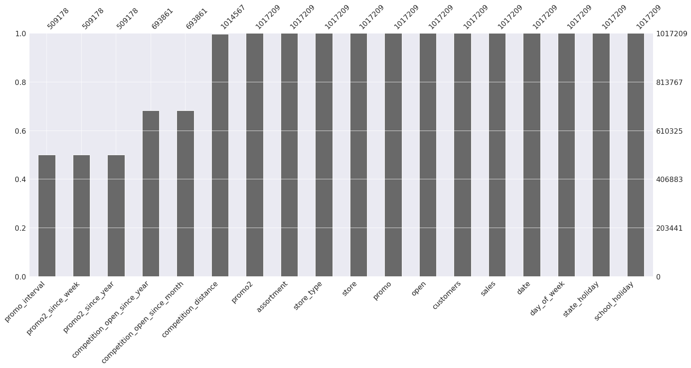
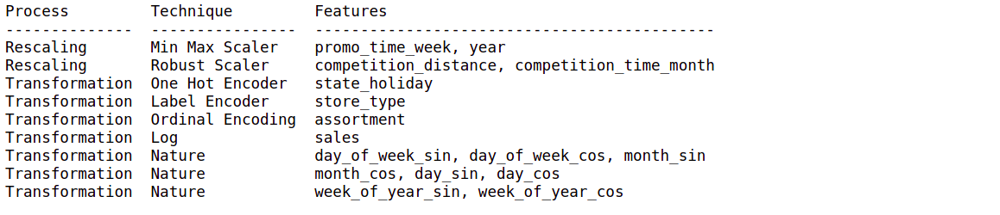
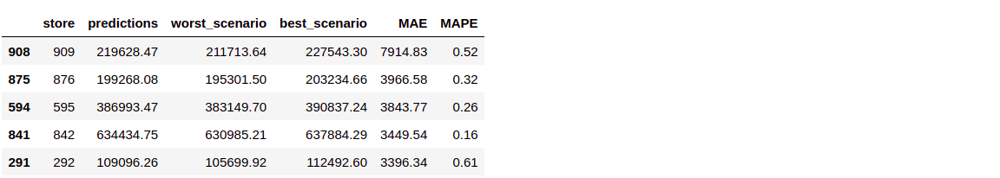

# Rossmann Store Sales

# 1 Business Understanding
Rossmann operates over 3,000 drug stores in 7 European countries. Currently, Rossmann store managers are tasked with predicting their daily sales for up to six weeks in advance. Store sales are influenced by many factors, including promotions, competition, school and state holidays, seasonality, and locality. 
With thousands of individual managers predicting sales based on their unique circumstances, the accuracy of results can be quite varied. (kaggle.com)

## 1.1 Business Question

What will be the sales per store for the next 6 weeks?

## 1.2 Business Objectives

Develop a standardized methodology for sales forecasting.

## 1.3 Project Plan

Through Exploratory Data Analysis, choose a Machine Learning Algorithm to forecast sales.

### 1.3.1 Data Product

API in Telegram that receives the store number and returns the sales forecast.
   
# 2 Data Undastanding
## 2.1 Collect Initial Data

The data was collected on the website kaggle.com, referring to the sales history of 1,115 Rossmann stores, the files are in csv format.

train.csv - historical data including Sales

test.csv - historical data excluding Sales

store.csv - supplemental information about the stores

<a href="https://www.kaggle.com/c/rossmann-store-sales/data" target="_blank">Data Source</a>
 
## 2.2 Data Description

### 2.2.1 Dimensions

Number of rows: 1017209

Number of columns: 18 

### 2.2.2 Missing values

### 2.2.3 Numerical Attribues

Obs: NaN values have been filled in

### 2.2.4 Categorical Attributes

# 3 Feature Engineering
## 3.1 Mind Map Hypothesis

The hypotheses mind map helps to think about what will be explored in the Data Exploration step and what features are not available and need to be created.

### 3.1.1 New features derived

# 4 Exploratory Data Analysis
## 4.1 Univariate Analysis
### 4.1.1 Response Variable

The distribution of sales is skewed to the right, which means that sales of some stores are much higher than most stores.

### 4.1.2 Numerical Variables

### 4.1.3 Categorical Variables

## 4.2 Bivariate Analysis

### 4.2.1 Hyphotesis Results

This information can be used in feature importance selection and to validate the empirical knowledge of the business.

## 4.3 Multivariate Analysis
### 4.3.1 Numerical Variables

### 4.3.2 Categorical Variables

# 5 Data Preparation

# 6 Machine Learning
## 6.1 Train and Test

Training min date: 2013-01-01

Training max date: 2015-06-18

Test min date: 2015-06-19

Test max date: 2015-07-31
## 6.2 Feature Selection - Boruta

Features selected with Boruta

## 6.3 Models

XGBoost Regressor was selected to deploy because the performance is close to Random Forest Regressor and it uses less computational resources.

# 7 Error Interpretation
## 7.1 Business Performance

Business team can use the prediction and consider the best and worst scenario base no Mean Absolute Error - MAE and Mean Absolute Percentage Erro - MAPE.

## 7.2 Machine Learning Performance

Some stores have a higher error rate compared to others; these stores are harder to predict, requiring another modeling strategy. 

# Deployment
Bot link: https://t.me/RossmannSalesBot

When entering the store number the bot in the telegram will return the sales forecast for the next 6 weeks.

