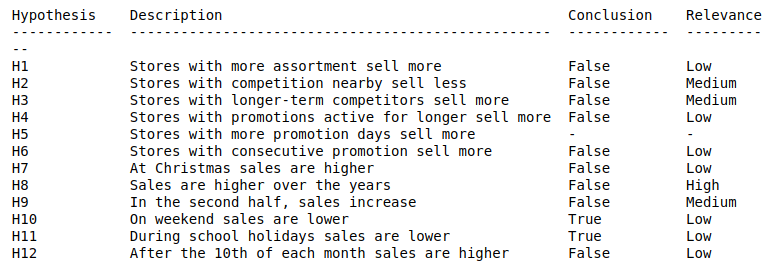

# Rossmann Store Sales

Rossmann operates over 3,000 drug stores in 7 European countries. Currently, Rossmann store managers are tasked with predicting their daily sales for up to six weeks in advance. Store sales are influenced by many factors, including promotions, competition, school and state holidays, seasonality, and locality. 
With thousands of individual managers predicting sales based on their unique circumstances, the accuracy of results can be quite varied. (kaggle.com)

# Business Understanding
## Business Question

What will be the sales per store for the next 6 weeks?

## Business Objectives

Develop a standardized methodology for sales forecasting.

## Project Plan

Through Exploratory Data Analysis, choose a Machine Learning Algorithm to forecast sales.

### Data Product

API in Telegram that receives the store number and returns the sales forecast.
   
# Data Undastanding
## Collect Initial Data

The data was collected on the website kaggle.com, referring to the sales history of 1,115 Rossmann stores, the files are in csv format.

train.csv - historical data including Sales
test.csv - historical data excluding Sales
store.csv - supplemental information about the stores

<a href="https://www.kaggle.com/c/rossmann-store-sales/data" target="_blank">Data Source</a>
 
## Data Description

### Dimensions

Number of rows: 1017209
Number of columns: 18 

### Data Quality
#### Missing values

### Numerical Attribues

Obs: NaN values have been filled in

### Categorical Attributes

### Feature Engineering
#### Mind Map Hypothesis

The hypotheses mind map helps to think about what will be explored in the Data Exploration step and what features are not available and need to be created.

#### New features derivered

Year: The year of sale

Month: The month of sale 

Day: The day of sale

Week of year: The number of week of the year

Year week: The year and week of sale

Competiton since: The month and year of the competition

Competition month: Competition month number

Promo since: Promotion start date

Promo time week: Number of weeks the promotion took place

# Exploratory Data Analysis
## Response Variable

The distribution of sales is skewed to the right, which means that some stores' sales are much higher than most stores.

## Hyphoteses Results

# Data Preparation
## Rescaling

Min max scaler was applied to competitio distance and competition time month

Robust scaler was applied to promo time week and year. 

This tecniques was applied to avoid bias. 

## Transformation
## Encoding
## Response variable transformation
## Nature Transformation

## Feature Selection
### Boruta
# Machine Learning Modeling

# Evaluation

# Deployment
